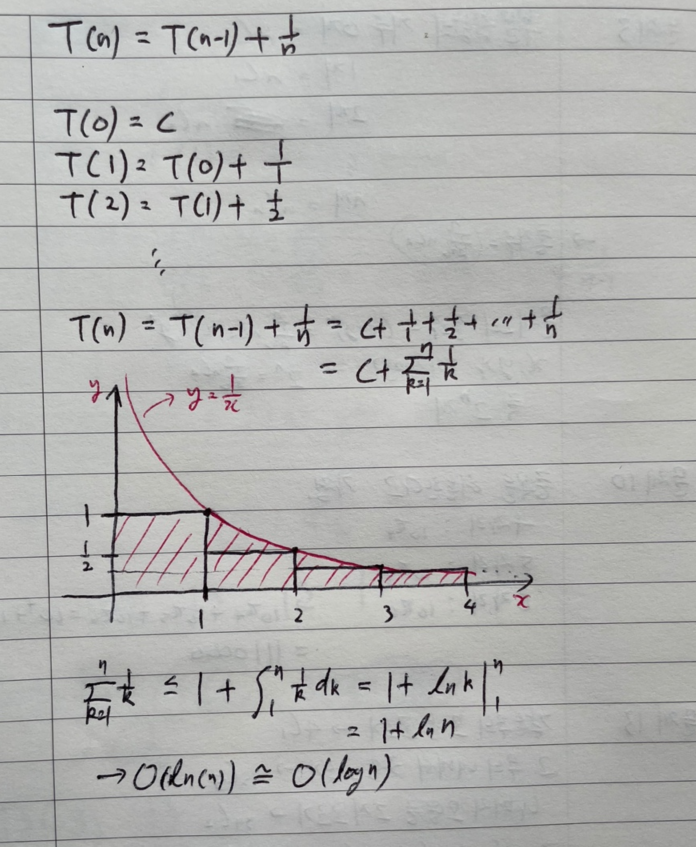

### 2번

수식 :  `T(n) = T(n-1) + n`

전제 : `T(0) = 1`

```
T(n) = T(n-1) + n
     = T(n-2) + n-1 + n		// T(n-1) == T(n-2) + n-1
     = T(n-3) + n-2 + n-1 + n
     = ...
     = T(0) + 1 + ... + n-1 + n
     <= T(0) + n ... + n + n		// 1~n까지의 수만큼 n으로 채운 것보다 작다.
     
     
그러므로, n이 n개 있는 모양이 된다.
```

```
O(n^2)
```


### 4번

수식 : `T(n) = T(n/2) + 1`

전제 : `T(1) = 1`

```
#과정

T(n) = T(n/2) + 1
	 = T(n/4) + 1 + 1
	 = ...
	 = T(n/(2^k)) + k	// k번 반복 시, 분모가 2의 k승이 됨에 따라 1이 k만큼 나온다.
```

```
# 결론

전제를 통해 T(1) = 1 임을 알 수 있다.

T(n/(2^k))를 T(1)으로 만들려면,
n = 2^k가 되고, k = log(n)이 된다.

따라서, T(n) = T(1) + log(n)
```

```
시간복잡도 : O(log(n))
```


### 6번

수식 : `T(n) = 2T(n/2) + n`

전제 : `T(1) = 1`

```
# 과정

T(n) = 2 * T(n/2) + n
	 = 4 * T(n/4) + n + n
	 = 8 * T(n/8) + n + n + n
	 = ...
	 
	 = 2^k * T(n/(2^k)) + k*n	// k번 반복하면, 왼쪽 수식과 같게됨.

```

```
# 결론

전제를 통해 T(1) = 1 임을 알 수 있다.

T(n/(2^k))를 T(1)으로 만들려면,
n = 2^k가 되고, k = log(n)이 된다.

따라서, T(n) = n*T(1) + nlog(n)
```


```
시간복잡도 : O(nlog(n))
```


### 8번

수식 : `T(n) = T(n-1) + 1/n`

전제 : X



