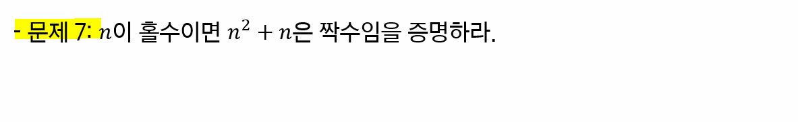

# 논리와 증명

> 함께 학습하고 고민하고 설명하며 작은 부분 하나라도 '내 것'으로 만들어보세요. 😁


### **이 과정은 왜?**

1. 컴퓨터공학에서 어떤 주제로 학습 하는지 경험해 볼 수 있습니다.
   - 하루만에 이 모든 지식을 다 내것으로 만들 수는 없지만 추후 학습의 작은 트리거가 될 수 있습니다. 
2. 문제를 풀 때 단순하게 느낌에 의존하는 것이 아닌 명확한 근거를 기반으로 사고하는 것이 어떤 것인지 체험해 볼 수 있습니다.
3. 개발자가 되기 위해 필요한 제반 지식을 얻을 수 있습니다.


### **아래의 규칙을 지켜주세요.**

1. 학습한 내용을 수기 작성, 테블릿 등을 활용하여 작성해 주시고 결과를 이미지로 첨부해주세요.

   - 물론 마크다운 등을 활용하여 결과를 작성해도 됩니다.

2. 모르는 내용이 나오면 팀원과 함께 자료를 찾아가면 공부해보세요.

   - '학습' 그 자체에 초점을 맞춰서 공부해보세요. 생각보다 많은 것을 얻어갈 수 있을거에요.

   - 조 별로 궁금한 내용을 서로 물어보고 찾아가며 함께 만들어가요.

3. 아래와 같은 순서로 학습하시는 것을 추천합니다.

   1. 교재를 기반으로 1차 학습

      - 한 문제 한 문제 같이 풀어보며 정답 작성하기

      - 중간에 풀리지 않는 문제 등은 빠르게 넘어가기

   2. 모든 문제를 다 풀고 풀리지 않는 문제로 돌아와서 2차 학습
      - 교재로 해결되지 않는 부분은 구글링을 통해 해결
      - 다른 조와의 협업을 통해서도 해결 가능

4. 최종 풀이 완료 이후 **조 별 하나의 공동 문서를 작성하며 정리**


### 모든 문제를 푸셨다면

1. 조 별 완성본 파일이 담긴 1개의 폴더 준비

   - 조장이 `1_논리와 증명.md` 파일 최상단에 조장 & 조원 명단 작성

2. 조장이 조별(`n조`) 폴더 만들어서 PR 보내기

   - 조장만 진행

   - 조 별 완성본은 1개만 제출

   - PR 폴더 구조

     ```
     ...
     0926/
     	...
     0927/
     	...
     0928/
     	1조/ # 폴더
     		1_논리와 증명.md
     		2_수와 표현.md 
     		...
     	2조/
     		1_논리와 증명.md
     		2_수와 표현.md 
     		...
     	3조/
     		1_논리와 증명.md
     		2_수와 표현.md 
     		...
     	...
     ```

     

### **참고 사이트**

https://www.desmos.com/calculator?lang=ko

https://www.wolframalpha.com/


## 1-2 번

                              

> 1번**~(~p^q) V q)** 와 **(~p V q) V (p ^ ~q)** 은 진리값이 항상 참이기 때문에 항진명제라고 볼 수 있다.


## 2-2 번  


> **(~p V q) ^ (p ^ ~q)** 와 **(p ^ q) ^ (p ^ ~q)** 모두 명제가 F이기 때문에 진리값이 항상 거짓인 모순명제이다.


## 3-2 번


## 4-2 번


> (p V ~q) ^ (~p V ~q) = (p ^ ~p) V ~q
>
> 여기서 (p ^ ~p)는 항상 False이기 때문에
>
> 정답은 ~q에 따라서 정해진다.
>
> 즉, ~q로 간소화가 가능


## 5-2 번 & 5-4번


**5-2번**

> ∀x ∈ Z x^2 ≥x
>
> 모든 x는 정수의 집합에 있고, x의 제곱은 x보다 크거나 같다.
>
> 즉, 음수 혹은 양수 0을 제곱해도 x의 제곱은 아무리 작아도 x와 같으므로 참이다.
>
> 만약 0 < x < 1의 범위안에 x가 존재한다면 해당 명제는 거짓인데, 해당 명제는 정수의 집합이기때문에 앞의 범위를 만족하지않아 명제는 참이다.

**5-4번**

> ∃x ∈ Z x^2 < x
>
> 어떤 x는 정수의 집합에 있고, x의 제곱은 x보다 작은게 존재한다.
>
> 위의 명제를 만족하는 범위는 0 < x < 1 인데, 이 범위안에는 정수가 존재하지 않는다.
>
> 즉, 위의 명제는 거짓임을 알 수 있다.


# 7번



> n이 홀수이므로 n = 2k + 1로 표현할 수 있다.
>
> 그러면 n^2 + n = (2k + 1)^2 + (2k + 1) = 4k^2 + 6k + 2가 된다.
>
> 즉 2로 묶으면, 2(2k^2 + 3k + 1)이므로 짝수가 된다.


## 9번


> n = 2k + 1로 치환해서 생각해보자.
>
> n^2 + 5 = (2k + 1)^2 + 5 = 4k^2 + 4k + 6 = 2(2k^2 + 2k + 3)가 되기 때문에 n이 홀수일 때, n^2 + 5는 짝수가 된다.
>
> 반대로 n^2 + 5가 홀수이면 n은 짝수가 된다.


## 10번


> 대우를 이용하면 n이 홀수일때 n^2이 홀수임을 증명하면 위의 문제가 증명된다.
>
> n = 2k + 1로 치환하게 된다면
>
> n^2 = (2k + 1)^2 = 4k^2 + 4k + 1 = 2(2k^2 + 2k) + 1로 홀수가 된다.
>
> 즉, n이 홀수일 때, n^2이 홀수임을 증명했기 때문에 대우로
>
> n^2이 짝수일 때, n이 짝수임이 증명된다.


## 11번


> 1. n : 짝수
>
>    n = 2k
>
>    n^2 + 5n + 3 = 4k^2 + 10k + 3 = 2(2k^2 + 5k + 1) + 1이므로
>
>    n이 짝수인 경우 n^2 + 5n + 3은 홀수가 된다.
>
> 2. n : 홀수
>
>    n = 2k + 1
>
>    n^2 + 5n + 3 = 4k^2 + 14k + 9 = 2(2k^2 + 7k + 4) + 1이므로
>
>    n이 홀수인 경우 n^2 + 5n + 3은 홀수가 된다.
>
>    즉, 모든 자연수 n에 대해 n^2 + 5n + 3은 항상 홀수이다.


## 12번


> n^2이 3의 배수이면 n은 3의 배수이다   <=대우=>   n이 3의 배수가 아니라면 n^2이 3의 배수가 아니다.
>
> 1. n = 3k + 1
>
>    n^2 = (3k+1)^2 = 9k^2 + 6k + 1 = 3(3k^2 + 2k) + 1
>
>    이므로 n^2은 3의 배수가 아니다.
>
> 2. n = 3k + 2
>
>    n^2 = (3k+2)^2 = 9k^2 + 12k + 4 = 3(3k^2 + 4k + 1) + 1
>
>    이므로 n^2은 3의 배수가 아니다.
>
> 위의 대우를 만족하였기 때문에
>
> n^2이 3의 배수이면 n은 3의 배수인 것은 참이다.

